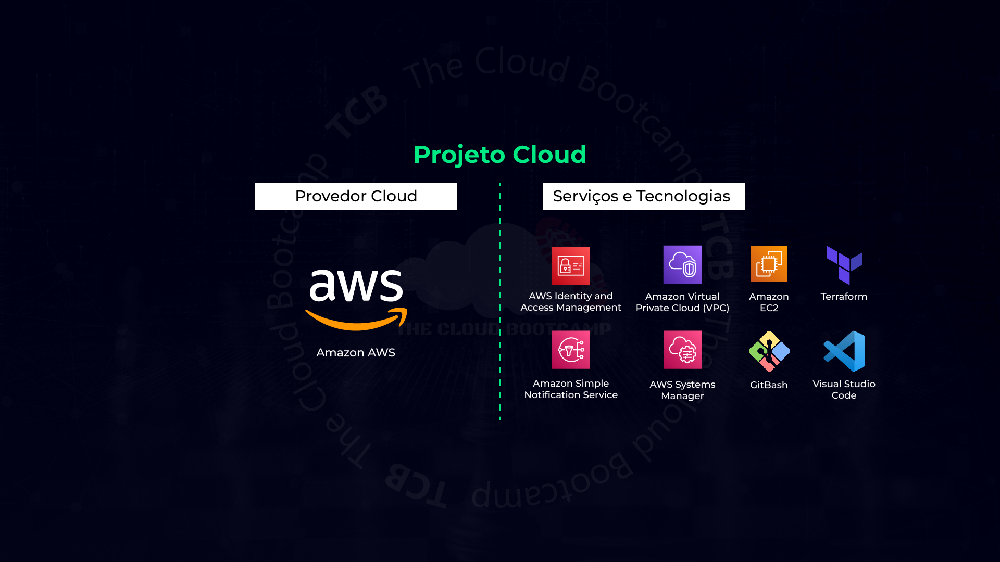
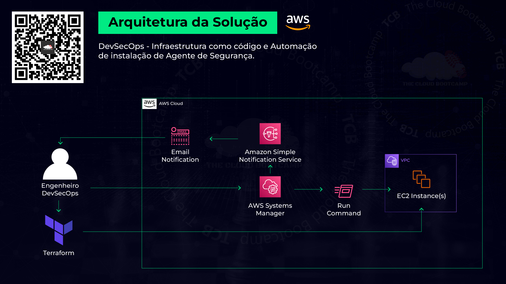
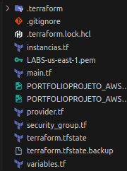
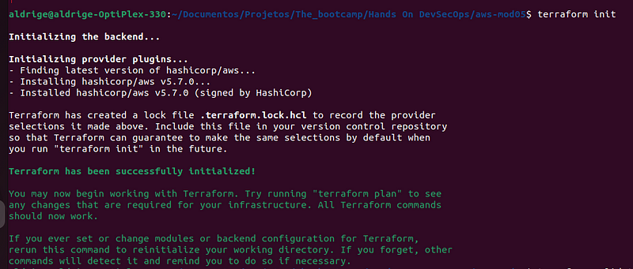
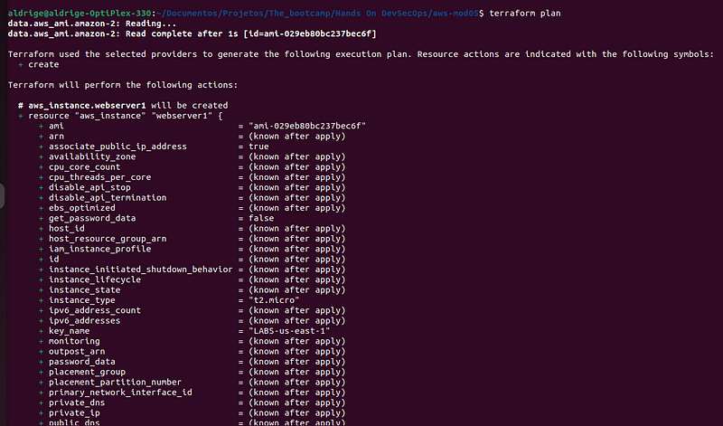
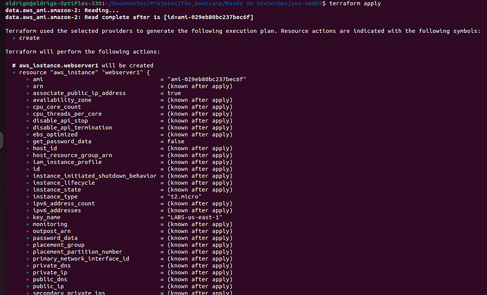
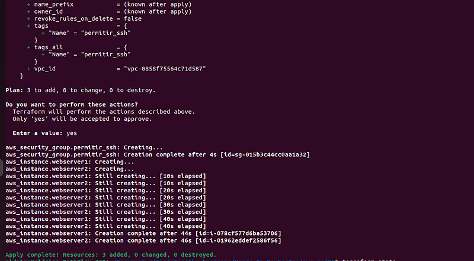
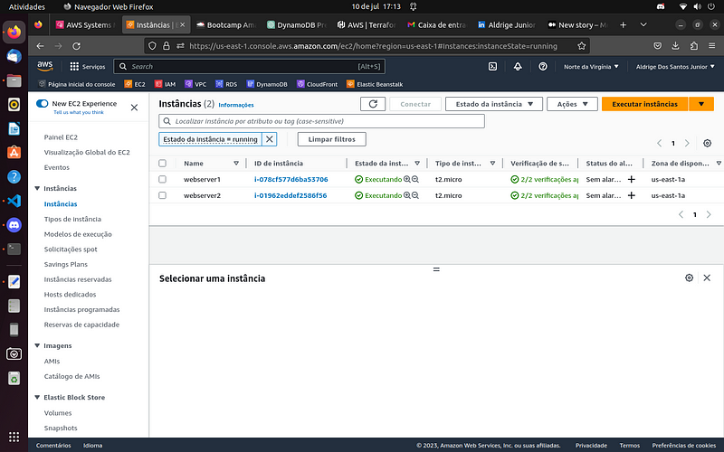
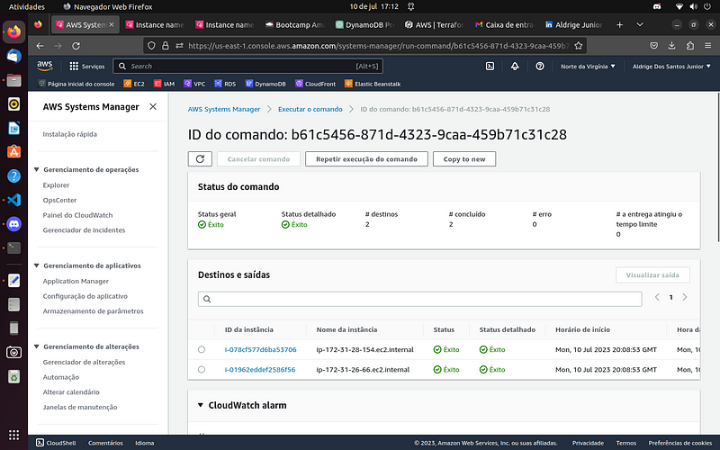

  <h1 align="center">Implementação de um conjunto de instâncias EC2 utilizando o Terraform e configuração do AWS Systems Manager fazendo uso do Amazon Simple Notification Service para instalação automatizada de agentes de segurança</h1>

## Descrição do projeto:
Nesse projeto baseado em um cenário do mundo real, atuei como Engenheiro de DevSecOps, onde implementei um conjunto de instâncias EC2 e a infraestrutura de forma automatizada utilizando Terraform (infraestrutura como código - IaC). Além disso, foi necessário instalar um agente de segurança específico e de forma automatizada em todas as instâncias.
Uma vez que provisionei a infraestrutura, foi utilizado o AWS System Manager e seu componente Command Run para a instalação dos agentes de segurança de forma automatizada. Fiz uso do Amazon Simple Notification Service - SNS para enviar um e-mail informando que todo o processo foi concluído com sucesso.

Parte 1 - Terraform
- Editar arquivos 'main.tf' e 'provider.tf':
- Vamos usar VPC_ID e SUBNET_ID default
Salve as alterações e crie um arquivo compactado com os arquivos do terraform:

- Executando o terraform
terraform init

• terraform plan

• terraform apply:

Instancias EC2 Funcionando:

Parte 2 - AWS Systems Manager
- Criar uma IAM role 'SystemsManagerToSNS'
• IAM | Role | Create Role
• Use cases for other AWS services: Systems Manager | Allows SSM to call AWS services on your behalf
• Policy: AmazonSNSFullAccess
• Role Name: SystemsManagerToSNS
- Criar um Tópico para Notitificações 'DevOpsNotification'
• SNS | Topic | Create Topic |
• Type: Standard
• Name: DevOpsNotification
• Copiar o "ARN" do Tópico criado!
Exemplo: arn:aws:sns:us-east-1:937193033886:DevOpsNotification
- Criar uma 'Subscription'
• Create Subscription
• Protocol: Email
• Endpoint: seu-email
• Acesse o e-mail informado e confirme o recebimento da notificação 'confirm subscription'

- Systems Manager
• System Manager | Quick Setup [confirme a região 'us-east-1' se for solicitado!]
• Configuration types: Host Management / create
• Targets: Choose how you want to target instances | Manual
• Selecione as instâncias que foram criadas via terraform
• Create!
• Validar 'Configuration deployment status' e 'Configuration association status'
• Acesse Quick Setup | Node Management: Session Manager | Clique em 'Start Session'
• Selecione uma instância e clique em "Start Session"
'cat /etc/*release*'
'ls -ltr /usr/bin/security_agent'

- Agente de instalação de Segurança
• Acesse Quick Setup | Node Management: Run Command | Run Command [ AWS-RunShellScript]
- Command parameters:
sudo wget -q https://tcb-bootcamps.s3.amazonaws.com/bootcamp-aws/pt/module5/install_security_agent.sh -P /tmp
sudo chmod +x /tmp/install_security_agent.sh
sudo /tmp/install_security_agent.sh
ls -ltr /usr/bin/security_agent
• Targets: choose instances manually | selecione as instâncias
• Desmarque [ ] Enable writing to S3 Bucket.
• Enable SNS Notification
IAM Role: SystemsManagertoSNS
SNS Topic: <ARN> arn:aws:sns:us-east-1:510907048761:DevOpsNotification
• Events notifications: all Events
• Change notifications: Command status on each instance changes
- RUN | Open the Email and check the notification!
Atualize a página, acesse uma das instâncias e verifique 'output'!

